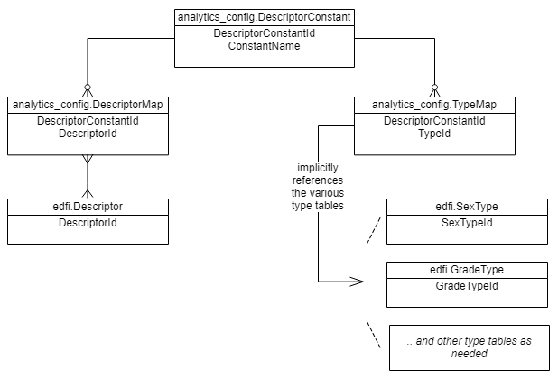

# Descriptor Mapping

## Introduction

Many of the views need to look for data based on a descriptor value. Since
descriptor values are mutable, changing from one installation to another, the
Analytics Middle Tier needs a mechanism for looking up a known constant value
and then cross-referencing it to custom descriptors. In order to support this,
each installation will need to create its own mappings.

### User Story

As an ODS administrator, I want to map my custom Descriptor values to universal
lookups used by the Analytics Middle Tier views, so that I can configure the
views through a table instead of by modifying the source code.

### Acceptance Criteria

* All views with hard-coded descriptor values should use a new mapping table.
* The mapping table should support many-to-many links.

## Solution

To solve for this problem, we introduce some new tables: three for Data Standard
2.x and just two for Data Standard 3.x. In theory, "Types" should solve for this
in Data Standard 2.x - but in practice, we have been told that they are not always
treated as universal constants. And in fact, "Type tables" no longer exist in
Data Standard 3.x.

When installed, the `DescriptorConstant` table is pre-populated with a range
of values that are required by the Analytics Middle Tier views. DO NOT CHANGE
THE DATA IN `analytics_config.DescriptorConstant`!

Instead, you must setup appropriate data in the `analytics_config.DescriptorMap`
and `analytics_config.TypeMap` tables. The correct values will depend on the
actual Descriptors and Types in your system.

## Sample Mappings

The following two files contain `MERGE` statements that will load the correct
mappings for both Descriptors and Types, based on the default data used in the
out-of-the-box Ed-Fi ODS sample databases.

* [descriptor-maps.sql](../samples/descriptor-maps.sql)
* [type-maps.sql](../samples/type-maps.sql)
