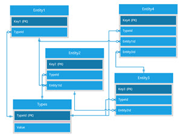
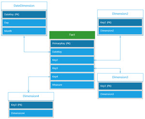
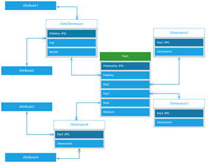
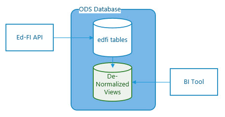

# Analytics Middle Tier Design

## Contents

* [Background](#background)
  * [Problem Definition](#problem-definition)
  * [Historical Ed-Fi Solutions](#historical-ed-fi-solutions)
  * [Core Concepts in Modern Business Intelligence / Analytics](#core-concepts-in-modern-business-intelligence--analytics)
* [Proposal for an Analytics Middle Tier](#proposal-for-an-analytics-middle-tier)
  * [Requirements](#requirements)
  * [Solution: De-normalized Views](#solution-de-normalized-views)
  * [Roles / Scopes of Data Access](#roles--scopes-of-data-access)
* [Further Reading](#further-reading)

*[Back to main readme](../readme.md)*

## Background

### Problem Definition

Analytics tools offer the great promise of uncovering insights by making visible
the connections between data. The latest generation of tools go further by
supporting self-discovery by end-users who can quickly and easily answer their
own questions through creation and consumption of powerful data visualizations.
These visualizations are built over a data model, which must be sufficiently
intuitive to the analyst utilizing it.

The core focus of the Ed-Fi ODS is to consolidate disparate transaction data
sources at the operational level to facilitate Enterprise Application
Integration (EAI) across K-12 source transaction systems.  The Ed-Fi ODS is
highly normalized, reflecting the Unifying Data Model's design principle of
defining and storing data in its most granular form. The systems that write to
(and read from) the ODS are many and varied.

All of this leads to a necessarily complex data model. While this data model
excels at storing and retrieving individual data records, it requires deep
understanding before an analyst can build downstream aggregations. Self-service
business intelligence would benefit from provision of intuitive logical models
overlaying the existing ODS data model, which can be more quickly understood by
those designing analytics visualizations.

### Historical Ed-Fi Solutions

The Ed-Fi Alliance has developed several solutions, summarized below, that
provide visualizations and/or foundational support for analytics solutions. To
date, these have not achieved widespread adoption and utilization in the field.
Furthermore, they do not provide a strong foundation for self-service BI
reporting.

| Solution | Description | Limitations |
| -------- | ----------- | ----------- |
| Ed-Fi Dashboards | Ed-Fi Dashboards provide a starting point for developing student performance dashboards that put real-time, actionable information at the fingertips of educators. It includes a user interface with metrics that educators identified as critical to improving student achievement. | Difficult to maintain or extend, both conceptually and due to the technology stack. |
| Ed-Fi Data Warehouse | The Ed-Fi Data Warehouse consists of database schema of the Ed-Fi Data Model in a dimensional format and SQL Server SSIS packages to populate the data warehouse from an Ed-Fi ODS. | Difficult to maintain or extend, both conceptually and due to the technology stack. |
| Ed-Fi ODS/API and Microsoft Power BI Starter Kit | A starter kit illustrating the use of Microsoft Power BI to create meaningful visualizations from an Ed-Fi ODS. Includes reports at the district, school, teacher, and student level for early warning indicators described in the Balfanz model. | Poor query performance; difficult to maintain and extend due to the 1-to-1 representation of tables and the use of complicated DAX scripting.
| AWS QuickSight Spike |Reproduces a portion of the reports from the Power BI starter kit, using Amazon's QuickSite reporting tool. | Minimal proof-of-concept. |

### Core Concepts In Modern Business Intelligence / Analytics

#### Data Model and Data Visualization

A BI data model brings together data from one or more sources and generally
supports:

* Data relationships
* Calculated measures
* Slicers / filters
* Data security

Many BI platforms include a proprietary database engine and modeling tools for
storing data and supporting these concepts, e.g. Microsoft SQL Server Analytics
Services (SSAS). The key components of a BI platform, however, are the data
visualizations ("reports"). These provide the graphical end-user experience that
utilizes the data model.

#### Semantic Modelling Approaches

The ODS database is relational and _normalized_ to avoid duplicate data
storage. The web of relationships in such databases can make them difficult to
visualize and understand. Extracting data from a fully normalized database
requires the programmer to bring together data from many different tables, one
linking to another in a series of _joins_. _Foreign keys_ enforce presence of
data in related tables (referential integrity).

A star schema approach, on the other hand, denormalizes the data, allowing
duplication in columns. A fact table is at the "center" of the star. It contains
keys to other entities, though  they are not enforced as in the fully-relation
foreign keys, along with measures - typically numeric values that can be used in
aggregations. The "rays" of the star are dimension tables. These have a
uniquely-identifying key along with dimensions that are string descriptors. A
Date Dimension tables is common, providing various string descriptors for every
given day across some pre-defined range (e.g. day number, month number, year,
quarter name, etc.).

A snowflake schema starts with the star schema, with the addition of attributes
tables partially normalizing the dimension tables. While a snowflake can be
useful, semantic models that stay close to the star schema ideal will be easier
for analysts to understand.

#### Data Extraction

While many BI platforms now support visualizations based on external data
(mashups), enterprise solutions continue to utilize data stored in
analytics-optimized database engines. These require a mechanism for extracting
data from source systems and loading into the target system, often applying
additional business rules (transformations). The BI platforms typically contain
their own ETL engine with scheduling capabilities.

The analytics engines in these BI platforms have powerful capabilities for
aggregating large volumes of data and applying filters. While pre-calculating
metrics in a data warehouse remains a valuable technique, self-service systems
generally take advantage of the BI platform's calculation capabilities so that
algorithms can vary based on the questions being explored. For self-service
systems, data transformations in ETL/ELT processes should be minimized,
reshaping data to an optimized structure (e.g. star schema) without
pre-calculating metrics.

#### Data Security

Typical BI solutions require authorizing differing levels of access to data. For
example, a teacher might be granted access to the data for students in only his
classes, whereas a principle might have access to all data in her school. Many
BI platforms provide mechanisms for row-level security. Ideally the
implementation of row-level security will take direct advantage of the data
model without need for complex scripting, and changes to data in the model would
dynamically impact a user's authorization to rows: model-driven dynamic
row-level security. BI platforms have different ways of managing this. Any
solution may need to provide multiple structures to support different technology
choices, and to support different interpretations of federal, state, and local
regulations on student data privacy.

#### Metrics

In the K-12 space, metrics include concepts such as attendance and grade point
average - values that can be calculated from granular data in the ODS. States
and districts will have differing business rules for calculating metrics. For
example, one state might count attendance "at school," while another might look
at attendance "in all classes" for the day, and yet another might look to a
student's presence in a specific "homeroom." BI platform analytics engines are
tuned for calculating metrics from large volumes of data. For self-serve
analytics, these calculations can be made using the analytics engine's data
model rather than in the source system. If consistency of calculations is
required, downstream consumers might consider pre-calculating and storing some
metrics.

## Proposal for an Analytics Middle Tier

### Requirements

To summarize, analytics based on the Ed-Fi ODS would be more effective if there
were a solution meeting these requirements:

1. provides a simplified data model, using a star schema approach
1. provides granular data, minimizing the number of calculations /
   transformations
1. supports model-driven dynamic row-level security
1. leaves the business of extracting and loading data to the BI platform of
   choice (thus a _conceptual_ middle tier rather than a _logical_ one).

### Solution: De-normalized Views

A set of dimensional views can provide the appearance of de-normalization
without the need to run periodic ETL processes. Such de-normalized views can
significantly reduce the complexity of the ODS so that the data modeler can
focus on building calculated metrics in the BI platform with less time spent
analyzing the ODS tables. Long-term maintenance is improved when the interface
presented by the views is treated as immutable: changes in the underlying tables
are hidden from the view consumers, who continue to "see" the same columns
before and after core ODS data model changes.

Aggregations / calculations will not be included in the views, to the extent
possible. Some data in the ODS might not be sensible at the most granular level,
and thus a degree of aggregation may be required on a case-by-case basis.

The needs of the community are many and diverse. It would be impractical to
provide views supporting all analytics needs. Instead, a selection of views will
be provided to support some well-defined use cases. These can be modified or
added to for satisfying additional use cases. The initial use case will be an
Early Warning System.

### Roles / Scopes of Data Access

In K-12 scenarios, several roles immediately come to mind that would clearly
require different degrees of authorization to student data:

* Superintendents see data for all students in their district.
* Principals see data for all students in their school.
* Teachers see data for all students in their classes.
* Parent sees data for all their children.
* Students see only data for themselves.

Real-world usage might not map job titles to data authorization levels in such
a simple manner. There may be district employees other than superintendents who
need access to all students. An Assistant Principal might take the lead on
checking an Early Warning system. Rather than speaking about roles, the Analytics
Middle Tier views define these _access scopes_:

* District
* School
* Section
* Student

Other scopes can be imagined but may not be supported initially (e.g.
counsellors assigned to cohorts of student).

## Further Reading

* [Dimensional Views](dimensional-views.md): descriptions of the dimensional views provided by the Analytics Middle Tier, which can serve as building blocks for many different use cases.
* [Installing the Ed-Fi Analytics Middle Tier](installation.md): documentation on install, uninstall, and next steps.
* [Patterns and Practices](patterns-and-practices.md): practical guidance and suggestions on performance, metrics, and security.
