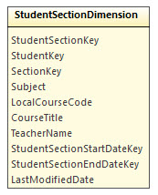

# Dimensional Views

* [General Principles](#general-principles)
* [Student Views](#student-views)
* [Education Organization Views](#education-organization-views)
* [Sections Views](#section-views)
* [Date-Related Views](#date-related-views)

*[Back to main readme](../readme.md)*

## General Principles

While most of these dimensional views have been created initially to support the
[Early Warning System](early-warning-system.md) use case, they could be used
just as easily with custom fact views that address different questions.

Where it makes sense, a `LastModifiedDate` column exists so that ETL tools can
perform partial data loads, e.g. import all records modified since (last import
date time). Because a view frequently combines data from multiple tables that
each have their own `LastModifiedDate`, the view selects the most recent of all
available date/time stamps to display as its own.

Primary key fields on each table may be surrogate keys - combining each natural
key field into a single string - or they may be the integer identifiers from a
table, where such exist. Whenever a source table has a `-USI` suffixed key
column, that column is used as the primary key field, e.g. `Student.StudentUSI`
becomes `StudentKey`. The more generic name `Key` helps data analysts to more
quickly understand the model.

## Student Views

A student can have zero to many racial identifiers and (family) contacts, making
it impractical to fully flatten student information into a single view.
Envisioning that a BI tool would be most likely to display the _primary contact_
for a student, that contact person's information has been flattened into the
main view. If multiple contacts are marked as the primary contact, then the view
selects the first one returned by the database engine. The `StudentDimension`
sets the `ContactAddress` from the first non-blank value from the
`ContactPersonDimension`, with the following precedence order:

1. Home
2. Physical
3. Mailing
4. Work
5. Temporary

The `ContactEmailAddress` is selected from Personal and Work addresses based on
the `PrimaryEmailAddress` value (which will be "work" or "personal"). First name
and last name are left as separate fields in both `StudentDimension` and
`ContactPersonDimension` so that BI developers have the option of sorting or
grouping by last name - except for the `StudentDimension.ContactName` since this
value is likely to be for display only.

(!) When using the `ContactPersonDimension`, it may be important to pay
attention to the `ContactRestrictions` value. This field may indicate that a
parent should not be contacted, for example due to a restraining order.

## Education Organization Views

The `SchoolDimension` brings together basic information about a school,
including the local education agency to which it belongs, and the state agency
that the local agency in turn belongs to. The school might also participate in a
service center. Charter schools might be handled through the local education
agency or through the `SchoolNetworkAssociationDimension`.

The school dimension contains the flattened physical address as a single string.
It also contains the city, county, and state, which can be used as filters or
pivots. At this time there is no plan to add dimensions to provide more data on
the related (local, state, education center, network) entities. However, the key
values are provided for the convenience of those who might wish to introduce
their own dimensions for the related data.

`LocalEducationAgencyDimension` provides data about the school district or
charter equivalent. As districts can cross municipal boundaries, and initial
thinking about use cases does not reveal a need to display district addresses,
no geographical information has been included other than that implied by the
agency name and (where available) its state agency name.

## Sections Views

Instead of providing a view with one row per section, the
`StudentSectionDimension` provides one row _per student and section_. This
design makes it possible to link a grade fact with the `StudentSectionDimension`
(see [Early Warning System](early-warning-system.md)).

## Date-Related Views

Most Fact views will have a relationship to one of these two views. The
`DateDimension` provides values for every individual day in the source
`edfi.CalendarDateCalendarEvent` table. The `DateKey` string is of format
YYYYMMDD. The raw `DateTime` value is preserved in the `Date` field, and the
remaining fields have either integer or string-based representations of part of
the date. Example for September 25, 2018:

| Field | Value |
| ----- | ----- |
| DateKey | 20180925 |
| Date | 2018-09-25 00:00:00.000|
| Day | 25 |
| Month | 9 |
| MonthName | September |
| CalendarQuarter | 3 |
| CalendarQuarterName | Third |
| CalendarYear | 2018 |

The Grading Period covers a range of dates used by a school to split up the
school year. Grading periods can cover semester, trimester, six weeks, and/or
other time frames as used by the district. This view differentiates those period
types through the `GradingPeriodDescription` field. The two `-DateKey` fields
can be joined to the `DateDimension` if desired.