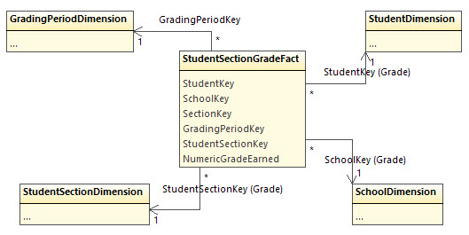
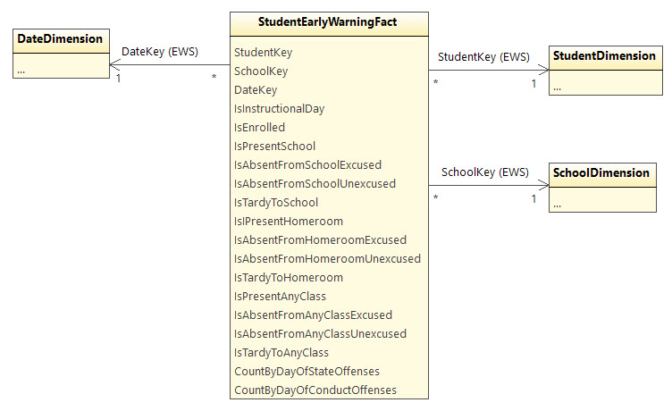

# Early Warning System

* [Overview](#overview)
* [Data Model](#data-model)
* [Calculating Metrics](#calculating-metrics)
  * [Attendance](#attendance)
  * [Behavior](#behavior)
  * [Course Performance](#course-performance)
* [DataMart and EWS Views](#datamart-and-ews-views)

*[Back to main readme](../readme.md)*

## Overview

The source code repository contains a number of sample scripts in the
[samples](../samples) directory. These scripts can be used to create an Early
Warning System for high school dropout. Based on the Balfanz, _et al._ model for
early warning, they calculate metrics and risk factors based on four criteria:

1. Attendance
2. Behavior
3. Course performance
    1. English grades
    2. Math grades

One source for more information on this approach to early warning systems is [On
Track for Success: The Use of Early Warning Indicator and Intervention Systems
to Build a Grad Nation](https://eric.ed.gov/?id=ED526421). As noted in this
paper, "Local factors and policies also play a role in determining the cut
points." (p15). The at-risk and early-warning thresholds used in these samples
may or may not be appropriate for a given district or state. Furthermore, the
calculations themselves might not be meaningful in all situations - for example
the attendance model might be too simplistic.

## Data Model

The data model contains two fact tables with different date dimensions:
`StudentSectionGradeFact` represents a grade assigned to a date range (grading
period), and `StudentEarlyWarningFact` brings together attendance and behavior
information on a daily basis. Also see [Dimensional Views](dimensional-views.md)
for more information on the other views in this model.



The `StudentSectionGradeFact` view provides raw data for course performance: the
grade earned for a student in a section during a grading period. It only
provides this information for grades of type "grading period", which is the most
granular available per grading period - typically a unit smaller than a
trimester or semester. The fact tables do not support the grade book for two
reasons: (1) there are too many ways to calculate total grade from gradebook
entries, and (2) field experience shows that Ed-Fi implementations are much more
likely to populate the `Grade` table (by grading period) than the
`GradeBookEntry` (homework, quiz, test grades). While there is no independent
`Section` view, the `SectionKey` value may be critical for [user data
authorization](patterns-and-practices.md#data-authorization).



The early warning attendance and behavior data are supplied by
`StudentEarlyWarningFact`, using three key fields: Student, School, Date. The
`SchoolKey` supports students who might be dual-enrolled and it may be used for
[user data authorization](patterns-and-practices.md#data-authorization).

Attendance rates will not be pre-calculated due to the various business rules.
Instead, the view provides multiple views on attendance, with data from two
different perspectives:

1. Attendance indicators
    * Tardy
    * Excused Absence
    * Unexcused Absence
    * Present
2. Attendance scope
    * Homeroom
    * Any class
    * School

Which factors are used for calculating attendance depends on the school and on
how attendance is recorded in the source systems. Some systems may record
attendance in the positive sense (student is present), while others might only
record when the student is absent or late.

The behavior fields provide counts of infractions per day. Not all behavior
incidents are recorded here - only those marked as a "state offense" or as a
"code of conduct violation."

## Calculating Metrics

### Attendance

These scripts assume that the district tracks absence rather than presence. They
count a student as absent whether that was excused or unexcused. Some schools
will record attendance at the school scope, while others may record it at the level
of a class/section. Furthermore, some schools only look at the student's attendance 
at a designated "homeroom". These scripts assume that student attendance might be 
tracked for either a homeroom or at the school. From this we can build up the logic 
as follows:

<pre>
Number of Days Enrolled := number of instructional or make-up days on which
the student is enrolled at a school.

Number of Days Absent := number of days on which the student is marked as
absent (excused or unexcused) in either the school or classroom.

Attendance Rate := during a range of dates, (Σ Enrolled - Σ Absent) / (Σ Enrolled)  
</pre>

This calculation can be seen in `AttendanceTrend.sql`, `RiskIndicators.sql`,
and `EwsViews.sql`. The latter two scripts treat 80% attendance as "at risk"
(for dropout) and 88% as an early warning. These thresholds are easy to adjust
in the scripts.

### Behavior

The presence of _any_ state offense is assumed to indicate that the student is
at risk, whereas for code of conduct violations the threshold is set at 5
offenses for at risk and 2 offenses for early warning. These calculations are
simple counts accumulating over time.

### Course Performance

Course performance is evaluated for both English and Math classes. For English,
three course subjects (as recorded in the ODS) are considered together: English
Language Arts, Reading, and Writing. From this we can build up the logic as
follows:

<pre>
English Grade := during a grading period, the average of grades earned in
sections with Subject of English Language Arts, Reading, or Writing.

Math Grade := during a grading period, the average of grades earned in sections
with Subject of Mathematics.
</pre>

These calculations can be see in `StudentGradeByGradingPeriod.sql`,
`RiskIndicators.sql`, and `EwsViews.sql`. The `EnrolledSections.sql` script
simply provides the grade for any given section. These results in themselves are
not considered part of the early warning system; however, they may be useful for
display to end-users who want to know detail about failing grades.

Where these queries provide a risk assessment, they treat a student with a grade
below 65.0 in either Math or English classes as at risk, and they provide an
early warning flag for a grade below 72.0.

## DataMart and EWS Views

Where available, it is best to let analytics engines perform these calculations.
Some systems will not be capable of this, or it might be only with a great deal
of scripting and manipulation. There are a handful of views that can
optionally be installed with the command line flag `-o Qews`, which were originally
created to support the Early Warning System solution using AWS QuickSight:

| :no_entry: WARNING: do not install these views into a production ODS database |
| -- |

```powershell
.\EdFi.AnalyticsMiddleTier.Console.exe -c "Server=.;Database=EdFi_Glendale;Trusted_connection=true" -o Qews
```

* `StudentIndicators` returns the grades, behavior incident count, attendance
  trend, and (at risk, early warning, on track) indicators for students using
  the most recent available grading period for a school.
* `StudentEnrolledSectionGrade` provides the grades earned for each section
  in the most recent grading period.
* `StudentEnrolledSectionGradeTrend` provides the average Math and English
  grades for each prior grading period.
* `StudentIndicatorsByGradingPeriod` applies the same logic of
  `StudentIndicators` averaged across each available grading period.
* `SchoolRiskTrend` groups indicators by school.
* `StudentAttendanceTrend` lists the student's attendance rate for each month
  in the school calendar.
* `UserSchoolAuthorization` allows a user to access all students in a school.

Some of these queries, when selecting all students, will require a considerable
amount of time to complete. They should not be run directly on the production
ODS system. One way of improving query results is to _materialize the views_ -
that is, to copy all of the data from the views into real tables, perhaps in a
separate database. Then run the query against these materialized tables instead
of the source views. The script `AMT-DataMart.sql` in the `Samples` folder
creates and loads tables in a separate database on the same SQL Server instance.
We strongly recommend using installing the EWS views only in such a
data mart. Thus you would need to run the installer twice:

1. Install the base views in an ODS database
2. Create the Data Mart database
3. Manually run `AMT-DataMart.sql` in the new database
4. Install the EWS views _in the Data Mart database_.
