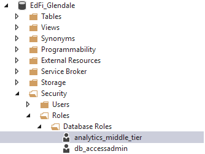
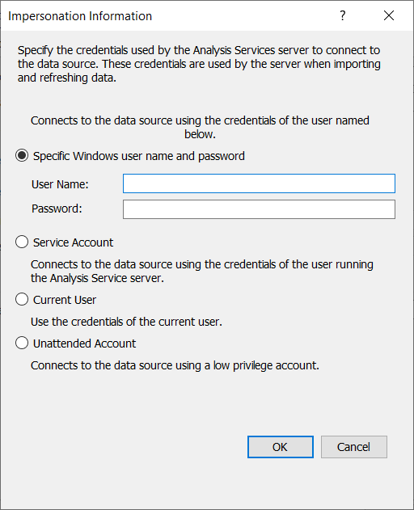
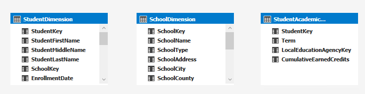
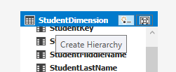
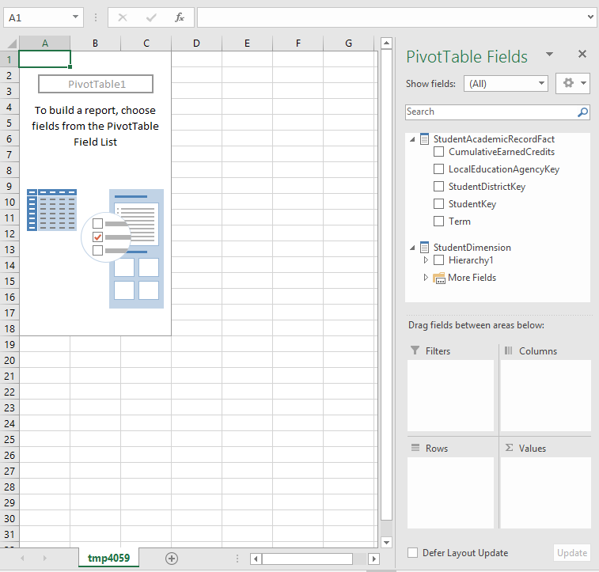
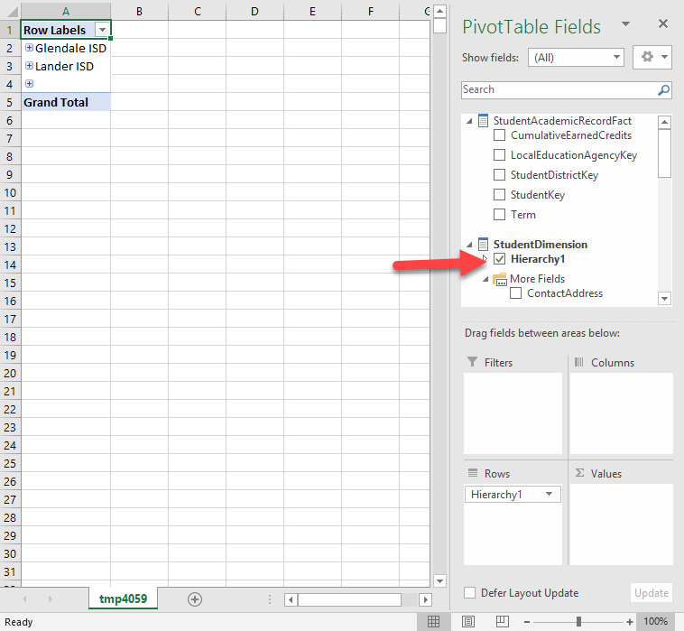
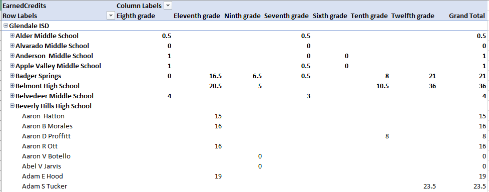

# Bootcamp Lab Exercise

## Goals

1. Install the Analytics Middle Tier on the Ed-Fi Glendale database.
1. Explore the dynamic security model.
1. Customize by adding a view.
1. Create a simple data model in a SQL Server Analysis Services Tabular Project
   Model.
1. Explore the model in Excel Power Pivot.

## Pre-Requisites

* [Analytics Middle Tier](https://github.com/Ed-Fi-Alliance/Ed-Fi-X-Analytics-Middle-Tier/releases/)
  * For the latest release, download both `EdFi.AnalyticsMiddleTier-win10.x64.zip` and the source code.
* SQL Server 2014+ with both the Database Engine and Analysis Services running.
* [SQL Server Data
  Tools](https://docs.microsoft.com/en-us/sql/ssdt/download-sql-server-data-tools-ssdt?view=sql-server-2017#ssdt-for-vs-2017-standalone-installer)
  * Be sure to customize and add Analysis Services support.
* An active 2.0, 2.2, or 3.2a data standard database (sample: [Glendale 2.0](https://s3-us-west-2.amazonaws.com/edfidata/ETL+Development/EdFi_Glendale_v20-20180613.7z) or [Glendale 3.2a](https://odsassets.blob.core.windows.net/public/Glendale/EdFi_Ods_Glendale_v33_20200224_Azure.bacpac))
  * Restore this backup file into a database called {{EdFi_Glendale}}
* [.NET 8.0.x](https://dotnet.microsoft.com/en-us/download/dotnet/8.0)
* [NuGet Commandline](https://www.nuget.org/downloads)

If using [chocolately](https://chocolatey.org), install the last three with
these commands in an Administrative command prompt:

```powershell
choco install dotnetcore-sdk -y
choco install nuget.commandline  -y
```

### Using Visual Studio for Database Queries

The SSDT installation provides a version of Visual Studio. Open up Visual Studio
and then open SQL Server Object Explorer (menu: View > SQL Server Object
Explorer). Connect to the same database used for installation above by clicking
the little icon with a green plus sign. Then right-click on the server
connection and choose New Query. Alternately, any commands discussed here can be
issued in SQL Management Studio.


## Installation

1. Unzip `EdFi.AnalyticsMiddleTier-win10.x64.zip` (or if using bootcamp VM,
   already done in `c:\src\EdFi.AnalyticsMiddleTier-win10`).
1. Open a command prompt and switch to the unzipped directory.
1. Install the views with this command (assuming database called `EdFi_Glendale`
   on the local machine):

   ```powershell
   .\EdFi.AnalyticsMiddleTier.Console.exe -c "Server=.;Database=EdFi_Glendale;Integrated Security=SSPI"
   ```

1. Run that command a second time - the output will indicate that there is
   nothing new to do.
1. Install the optional indexes:
    1. First inspect the storage size for the entire database (be sure to change
       {{EdFi_Glendale}} database name if using different database)

    ```sql
    SELECT total_size_mb = CAST(SUM(size) * 8. / 1024 AS DECIMAL(8,2))
    FROM sys.master_files
    WHERE database_id = DB_ID('EdFi_Glendale')
    GROUP BY database_id
    ```

    1. Install the indexes:

   ```powershell
   .\EdFi.AnalyticsMiddleTier.Console.exe -c "Server=.;Database=EdFi_Glendale;Integrated Security=SSPI" -o Indexes
   ```

   1. Run the query again to see how much growth occurred due to the new indexes.
1. Installing the indexes will take a few minutes. You may wish to move on to
   the new section and come back in a few minutes.

## Data Security

The "dynamic security model" can be used to provide row-level security in a BI
platform, consistent with FERPA requirements. You can learn more about this in
[Patterns and Practices](patterns-and-practices.md#dynamic-authorization-model).
This model requires a small amount of manual effort: mapping staff
classifications ("job titles") to a scope of student access. For this lab, we
will look at the views and stored procedures that help manage these mappings.

Run the following query, substituting the correct database name in line 1 if
not using one called `EdFi_Glendale`:

```sql
USE [EdFi_Glendale]
SELECT 
	[rls_StaffClassificationDescriptorScopeList].AuthorizationScopeName,
	[rls_StaffClassificationDescriptorScopeList].CodeValue 
  FROM 
	[analytics_config].[rls_StaffClassificationDescriptorScopeList]
```

You will probably get results like this:

| AuthorizationScopeName | CodeValue |
| ---------------------- | --------- |
| AuthorizationScope.Section| Teacher |
| AuthorizationScope.School| Principal |
| AuthorizationScope.District| Superintendent |

What does this mean? If the views are used to correctly provision row-level
security, this means that any Staff person with a classification of "Teacher"
will be able to access data for all students in her sections (classes); all
staff with classification of "Principal" will have access to data for all
students in her school; and all staff with classification of "Superintendent"
will be able to access data for all students in the entire district. (Further
guidance on row-level security will be provided in the upcoming PowerBI Starter
Kit v2).

Are these sufficient? Issue the following query to inspect the staff members 
and their classifications:

```sql
SELECT
    [Staff].[FirstName],
    [Staff].[LastSurName],
    [Descriptor].[CodeValue]
FROM
    [edfi].[Staff]
INNER JOIN
    [edfi].[StaffEducationOrganizationAssignmentAssociation] as [assignment] ON
        [Staff].[StaffUSI] = [assignment].[StaffUSI]
INNER JOIN
    [edfi].[Descriptor] ON
        [assignment].[StaffClassificationDescriptorId] = [Descriptor].[DescriptorId]
```

One of the `CodeValue` values we see is "Assistant Principal". Perhaps the district feels that Assistant Principals should also have access to all student data for the school. This stored procedure command will facilitate that:

```sql
EXEC [analytics_config].[rls_InsertStaffClassificationDescriptorScope]
    @StaffDescriptor = 'Assistant Principal', @Scope = 'AuthorizationScope.School'

-- Re-query the mappings to see the effect
SELECT  
		[rls_StaffClassificationDescriptorScopeList].AuthorizationScopeName,
		[rls_StaffClassificationDescriptorScopeList].CodeValue 
	FROM  
		[analytics_config].[rls_StaffClassificationDescriptorScopeList]
```

Should the lawyers come back and say that Assistant Principles are not in fact
"School officials with legitimate educational interest" ([FERPA
guidance](https://www2.ed.gov/policy/gen/guid/fpco/ferpa/index.html)) to view
all student data in the school, then issue the following commands to remove that
mapping and view the result:

```sql
EXEC [analytics_config].[rls_RemoveStaffClassificationDescriptorScope]
    @StaffDescriptor = 'Assistant Principal', @Scope = 'AuthorizationScope.School'

-- Re-query the mappings to see the effect
SELECT  
		[rls_StaffClassificationDescriptorScopeList].AuthorizationScopeName,
		[rls_StaffClassificationDescriptorScopeList].CodeValue 
	FROM  
		[analytics_config].[rls_StaffClassificationDescriptorScopeList]
```

## Database Access Security

In the SQL Server Object Explorer, expand the database > Security > Users >
Roles > Database Roles.



This role has select permission on all of the `[analytics]` views, but not on
the underlying tables. When connecting a BI / reporting tool to the database,
you can limit the scope of database access by connecting with a user account
that is in this role and no other.

## Customization - Adding a View

Let us suppose that you have data analysts who wish to explore student academic
records - specifically, the credits earned toward graduation. This is not a use
case currently supported in the Analytics Middle Tier. However, it is easy for a
district programmer to add this support by creating a custom "Fact table" view.
Here is the view to create:

```sql
CREATE VIEW [analytics].[StudentAcademicRecordFact] as

    SELECT
        [StudentAcademicRecord].[StudentUSI] as [StudentKey],
        CONCAT([StudentAcademicRecord].[SchoolYear]
            , '-'
            ,CASE WHEN [TermDescriptor].[CodeValue] = 'Fall Semester' THEN 1 ELSE 2 END
        ) as [Term],
        [StudentAcademicRecord].[EducationOrganizationId] as [LocalEducationAgencyKey],
        [StudentAcademicRecord].[CumulativeEarnedCredits]
    FROM
        [edfi].[StudentAcademicRecord]
    INNER JOIN
        [edfi].[Descriptor] as [TermDescriptor] ON
            [StudentAcademicRecord].[TermDescriptorId] = [TermDescriptor].[DescriptorId]
```

The following instructions could be done a little more directly in a full-blown
Visual Studio installation. To prove that Visual Studio is not required, these
instructions can use any text editor, including the SSDT version of Visual
Studio, Visual Studio Code, or even Notepad (if using the lab VMs, Code might be
the best option).

1. In directory `src\EdFi.AnalyticsMiddleTier.Lib`, create a `Scripts` folder
   for your custom SQL scripts.
1. Using the chosen text editor, create a file named
   `9000-View-StudentAcademicRecordFact-Create.sql` in that new `Scripts` folder.
1. Open the `.csproj` file in `src\EdFi.AnalyticsMiddleTier.Lib`.
1. Manually add a new embedded resource with the name of the file just created.
   Save and close.

   ```xml
    <None Remove="Scripts\9000-View-StudentAcademicRecordFact-Create.sql" />
    <EmbeddedResource Include="Scripts\9000-View-StudentAcademicRecordFact-Create.sql" />
   ```

1. Open a terminal / command prompt and switch to the source directory. If using
   Code, keyboard command Control-` will do the trick.
1. Switch to the `src` directory (remaining commands shown below).
1. Restore NuGet packages.
1. Build the solution.
1. Run integration tests to ensure that the view installs cleanly.
1. Run the installer application to install the new view.

In the following script, the first line is only needed if opening a PowerShell
or Command prompt without the help of Code.

```powershell
cd c:\src\Ed-Fi-X-Analytics-Middle-Tier-1.0.0
cd src
nuget restore EdFi.AnalyticsMiddleTier.sln
dotnet build EdFi.AnalyticsMiddleTier.sln
dotnet test EdFi.AnalyticsMiddleTier.Tests\EdFi.AnalyticsMiddleTier.Tests.csproj
dotnet EdFi.AnalyticsMiddleTier.Console\bin\debug\netcoreapp3.0\EdFi.AnalyticsMiddleTier.Console.dll -c "Server=.;Database=EdFi_Glendale;Integrated Security=SSPI"
```

This should provide output like:

```powershell
Beginning transaction
Beginning database upgrade
Checking whether journal table exists..
Fetching list of already executed scripts.
Executing Database Server script 'EdFi.AnalyticsMiddleTier.Lib.Scripts.9000-View-a.sql'
Checking whether journal table exists..
Upgrade successful
Success!
```

To prove that it installed correctly, issue this SQL query:

```sql
SELECT * FROM [analytics].[StudentAcademicRecordFact]
```

## Tabular Data Model

SQL Server Analysis Services provides a database modeling tool called the
Tabular Data Model. This is just one of many BI platform tools available to
education agencies for supporting self-serve analytics. It happens to be one of
the more popular ones right now and it is easy to demonstrate.

1. Open SSDT (Visual Studio).
1. Create a new project of type "Analysis Services Tabular Project"

   
1. Next you will see a dialog box called "Tabular model designer." In that box,
   connect to the localhost (or whatever server you used to install the
   Analytics Middle Tier above).
1. Now you should see a "Model.bim" file open in Visual Studio.
1. To start adding data from the ODS, click on the _Model_ menu and then _Import
   from Data Source_.
1. This opens a wizard. Step-by-step responses:
    1. Select "SQL Server". Next.
    1. Connect to SQL Server:
        * `localhost` or `.`.
        * Use Windows authentication.
        * Select the {{EdFi_Glendale}} database, or whichever database you used above.
        * Next.
    1. Impersonation
        * Specific windows user name and password
        * Username on lab VM: edfi
        * Password on lab VM: asd.123.lkj
        * Next.
		* Note:  If you are using your Active Directory account to log into the Analysis Server you will want to choose "Specific Windows user name and password" option.  The username will be {domain}\{user} and your domain password.
		 
    1. Choose how to import:
        * Select from a list.
        * Next.
    1. Select Tables and Views:
        * Sort by schema
        * Select these three views from the `analytics` schema:
            1. StudentAcademicRecordFact
            1. StudentSchoolDim
            1. SchoolDim
1. Wait for a minute or more while data are imported...
1. Switch to Diagram mode to create relationships between the tables:

   
1. Initially you should see a layout like this (arrangement may differ):

   
1. First create a relationship between `StudentSchoolDim` and `SchoolDim`
   by dragging `SchoolKey` from one table to the other.
1. We also need a relationship between `StudentSchoolDim` and `StudentAcademicRecordFact`. Unfortunately `StudentKey` alone won't do the trick - note that the new view provided both `StudentKey` and `LocalEducationAgencyKey`, because a student can, in some circumstances, be enrolled in multiple schools. To address this, let us create a new surrogate key in each table, combining the two fields into one.
    1. Switch back to the Data mode (tabular icon next to the Diagram mode icon).
    1. Find the `StudentSchoolDim` tab.
    1. Add a new column to the end and call it `StudentDistrictKey`.
    1. In the formula bar above the columns, enter the following formula, which
       takes advantage of the
       [DAX](https://msdn.microsoft.com/en-us/query-bi/dax/data-analysis-expressions-dax-reference)
       `Related` function to pull in data from the newly-related
       `SchoolDimension` table:
       `[StudentKey]&"-"&RELATED(SchoolDimension[LocalEducationAgencyKey])`
    1. While you're here... add several more calculated columns that will make
       it easier to create visual displays from this model:
        1. `StudentName` with formula `[StudentFirstName]&"
           "&[StudentMiddleName]&" "&[StudentLastName]`
        1. `School` with formula `RELATED(SchoolDimension[SchoolName])`
        1. `District` with formula
           `RELATED(SchoolDimension[LocalEducationAgencyName]`

           
    1. Switch to the `StudentAcademicRecordFact` tab and add a calculated column
       `StudentDistrictKey` with formula
       `[StudentKey]&"-"&[LocalEducationAgencyKey]`.
    1. Back to Diagram mode. Drag `StudentDistrictKey` from `StudentDimension`
       to `StudentAcademicRecordFact` to create the relationship between the two.
       
    1. An end user will probably want to explore the data by drilling down from
       District to School to Student. Now you will see why we added the `School`
       and `District` calculated columns. On the `StudentDimension` table, click
       the lightbulb icon to start creating a hierarchy.

       
    1. Under `Hierarchy1`, drag first `District`, then `School`, and finally
       `StudentName`.
    1. Since the hierarchy is embedded on the `StudentDimension` table, end
       users exploring the data do not need to see the `SchoolDimension` table.
       Right-click on it and choose Hide from Client Tools.

       
    1. End result:

       

As a next step, it may make sense to analyze the data in Excel using Power
Pivot. This is a quick-and-dirty approach to validating the output from the
model, and by itself it can be a robust tool.

1. Click the Excel icon in the toolbar.

   .
1. In the next dialog box, accept the defaults and click OK.
1. Excel opens, looking something like this:

   
1. Click on `Hierarchy1` to add it to the Rows box.

   
1. Would like to add `CumulativeEarnedCredits` to the Values area so that we can
   see the earned credits in a column. But you can't do so because it isn't a
   Measure.
1. Switch back to SSDT, open the Data mode, and click on the
   `StudentAcademicRecordFact` table.
1. Click in the empty cells below the data display. This lets us create a
   _measure_ - something that can be used in calculations. In this case, the
   student data are available by Term (e.g. semester). Let us explore the
   student's _current credits_ rather than historical, by using this formula for
   the measure:
   `EarnedCredits:=MAX(StudentAcademicRecordFact[CumulativeEarnedCredits])`

   
1. Back to Excel... click on the Refresh button in the Analyze ribbon.
1. Now you will see EarnedCredits available as a Measure. Drag it into the
   Values panel.

   
1. The students' current earned credits will show up in the data. Expand
   _Glendale ISD_ and then _Beverley Hills High School_ to see all of the
   students there.

   
1. There are a lot of students. Perhaps we really want to know about 11th
   graders who are not on track. Drag `GradeLevel` to the `Columns` panel.

   
1. Click on the "Column Labels" dropdown in call B1 to filter on only 11th
   grade. Then sort that column to see the students with the lowest earned
   credits. Perhaps this list of students can be given to the school counselors
   to encourage summer school or other means for gaining enough credits for
   graduation.

   

One of the problems with using Excel this way is the lack of row-level security.
The data model also needs to be published to Analysis Services in order to make
it available to other computers - right now Excel is querying a temporary
version of the data model. It is possible to build some visualizations here in
Excel, and you can save the workbook and re-open it later. But eventually, this
Tabular Data Model might be most useful with visualizations built over it using
tools such as PowerBI, Tableau, or Vertica.
