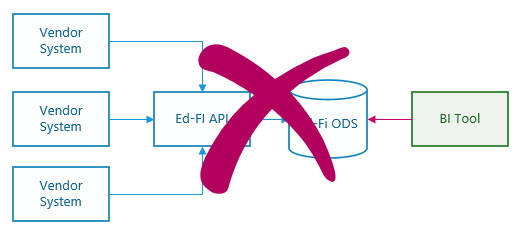
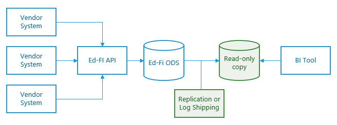
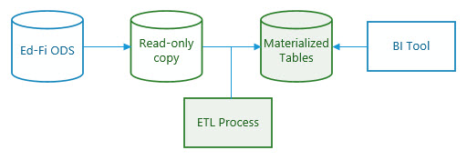
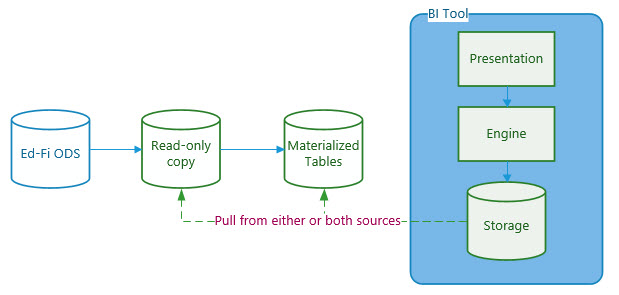
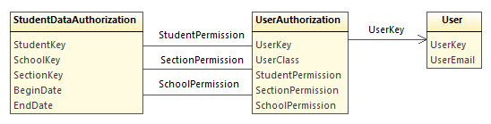
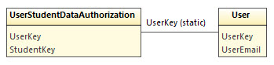
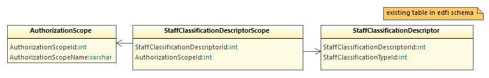

# Patterns and Practices

This document provides a number of patterns and practices that may prove useful
in any rollout of the Analytics Middle Tier solution in a production system. As
with any such guidance, readers will need to carefully evaluate applicability to
their systems, in consultation with internal and/or external experts on business
intelligence systems, data architecture, system security, etc.

## Contents

* [Limiting Impact on the Production ODS](#limiting-impact-on-the-production-ods)
  * [Avoid Direct Query Mode](#avoid-direct-query-mode)
  * [Read-only Copy](#read-only-copy)
  * [Materialized Views](#materialized-views)
  * [Analytics Engine Caching](#analytics-engine-caching)
* [Calculating Metrics](#calculating-metrics)
  * [Calculations in SQL Server](#calculations-in-sql-server)
  * [Calculations in the Analytics Engine](#calculations-in-the-analytics-engine)  
* [Data Authorization](#data-authorization)
  * [Dynamic Authorization Model](#dynamic-authorization-model)
  * [Static Authorization Model](#static-authorization-model)
  * [Managing Access Scope](#managing-access-scope)
* [Administrative Security](#administrative-security)
  * [Restrict Access By Role](#restrict-access-by-role)
  * [Encryption in Transit](#encryption-in-transit)
  * [Encryption at Rest](#encryption-at-rest)

*[Back to main readme](../readme.md)*

## Limiting Impact on the Production ODS

_Objective: minimize potential impact to the production ODS database_

### Avoid Direct Query Mode

The production ODS database is (in theory) constantly receiving new data
through calls to the API. The relational database is highly tuned for
efficient storage and retrieval of individuals records; this makes queries not
only difficult to write (hence the creation of this Analytics Middle Tier), but
also leads to long wait times while complex queries execute. Furthermore, a
business intelligence system or report should probably read only committed data.
If the [transaction isolation level](https://docs.microsoft.com/en-us/sql/t-sql/statements/set-transaction-isolation-level-transact-sql?view=sql-server-2017)
is set to REPEATABLE READ, READ COMMITTED, or SERIALIZABLE, then long-running
queries run the risk of locking tables and preventing the API from updating
them. The following strategies, taken individually or in combination, can
reduce the risk of negative impact to the production instance of the ODS.

### Read-only Copy

One common strategy for this sort of problem is to create a read-only copy of
the production system, and run all complex queries from this copy instead of
from the writable system. Three techniques available with SQL Server:

1. [Replication](https://docs.microsoft.com/en-us/sql/relational-databases/replication/sql-server-replication?view=sql-server-2017)
2. [Log Shipping](#https://docs.microsoft.com/en-us/sql/database-engine/log-shipping/about-log-shipping-sql-server?view=sql-server-2017)
3. Manual backup-and-restore

The second technique actually starts with a backup-and-restore and then copies
and replays transaction logs to the secondary server. Replication works through
subscriptions and schedules and can duplicate partial databases instead of the
entire database. Ideally the data on the secondary server would be refreshed
periodically; in this case the third option clearly doesn't scale.

If external systems are updating the ODS through the API on a constant basis,
then it may make sense to refresh the secondary several times per day. If
real-time support is desired, then transaction replication is the optimal
solution. If the system can tolerate periodic refresh of data, then log shipping
might be the preferred approach, as it is generally simpler to use than the
equivalent snapshot replication. However, if disk storage or security are
concerns, snapshot replication can be effective for scheduling duplication of
only the tables needed by the Analytics Middle Tier queries.

There are also some [third-party replication solutions](https://www.google.com/search?q=sql+server+third-party+replication)
that could be useful as alternatives to the Microsoft-based approaches.

### Materialized Views

While creating a read-only copy helps to avoid causing problems on the
production system, it does little nothing to improve the query performance. The
_materialized views_ technique queries the source tables (hopefully in a
read-only copy of the ODS) and loads the output into new tables. These new
tables can have their own indexing strategy, and queries off of them will
perform significantly better than queries against the views.

Some of the drawbacks of this approach include the need to scheduled refresh or
replacement of the new tables, additional process monitoring, and the added
storage cost associated with these large de-normalized tables.

The [Early Warning System](early-warning-system.md) sample scripts include a
"datamart" solution that creates materialized tables with indexes that support
all of the relationships in the model. It creates these tables in a tertiary
database. Although a large number of ODS source tables are not used, when
created from the Glendale data set, the tertiary database is of similar size to
the original database.

Although three database instances might now be in play, the read-only secondary
and materialized-view tertiary instances could easily be on the same _server_
instance.

### Analytics Engine Caching

Many business intelligence systems have a built-in analytics engine that
includes a database optimized for high-performance queries (e.g. Microsoft's
Tabular Data). These tools can often query a source system on a schedule and
store the results in their own caching mechanism or database. When such a system
is available, it will likely be a better choice than using materialized views.
However, it may still be advantageous to load the analytics engine from a
read-only view.

If the analytics engine is not advanced enough to support all of the desired
calculations, then it may be useful to perform calculations off of materialized
view tables before importing data into the analytics engine.

## Calculating Metrics

_Objective: calculate metrics in the most efficient engine available_

In the K-12 space, metrics include concepts such as attendance and grade point
average - values that can be calculated from granular data in the ODS. States
and districts will have differing business rules for calculating metrics. For
example, one state might count attendance "at school," while another might look
at attendance "in all classes" for the day, and yet another might look to a
student's presence in a specific "homeroom." For examples of metrics
calculations using the dimensional views, see the [Early Warning
System](early-warning-system.md) samples.

### Calculations in SQL Server

Skilled developers can easily perform calculations/aggregations in Transact-SQL
running in the database hosting the Analytics Middle Tier views. Taking this
approach would strongly reinforce the need to adopt one or more of the solutions
listed above for limiting negative impact on the production ODS performance.
Samples queries calculating various metrics are demonstrated in the [Early
Warning System](early-warning-system.md) scripts.

Where a BI tool has an advanced analytics engine, we recommend preferring it for
these calculations rather than running them in SQL Server. The Analytics Middle
Tier source code attempts to minimize the use of formulas, emphasizing instead
the reshaping of data into a model that is more easily consumed by the BI tool
of choice.

### Calculations in the Analytics Engine

Analytics engines in modern BI platforms have powerful capabilities for
aggregating large volumes of data and applying filters. These capabilities may
be closely connected with their use of database engines optimized for high
performance querying. When the BI tool is configured to import data into its own
database (cf [Analytics Engine Caching](#analytics-engine-caching)), that tool's
native capabilities should be leveraged for calculating metrics.

For example, Microsoft's SQL Server Analysis Services (SSAS) has a powerful
database product, the Tabular Data Model. A data model created with this tool
can incorporate metrics written using the DAX scripting language. Taking the
approach of first importing the Analytics Middle Tier views into a Tabular Data
Model, and then building metrics in DAX, is a highly efficient solution for
delivering data to presentation layers built in tools including Excel
PowerPivot, PowerBI, Tableau, and Vertica.

Non-Microsoft solutions typically have similar, and equally powerful,
capabilities for creating calculated fields and calculated tables. In some
cases, however, the analytics engine's ability to perform calculations on the
data model provided by the Analytics Middle Tier may be limited to simple
aggregations. Calculated tables and more complex formulas may be difficult or
impossible to represent in some tools. When this is the case, some calculations
might need to be offloaded into SQL before importing data into the analytics
database.

As a case in point, in the Alliance's proof-of-concept work using Amazon
QuickSights, the SPICE in-memory engine was found to be highly capable of
calculating aggregations and trends using the dimensional views, but further
transformation in SQL was required in order to develop risk indicators based on
calculations. In other words, we did not see a way to create a calculated field
("risk indicator") based on another calculated field ("average math grade").
Additional custom views, deployed in addition to the Analytics Middle Tier
views, were used to get to the desired risk indicator measures.

## Data Authorization

_Objective: limit end-user access to student data_

The [Family Educational Rights and Privacy
Act]((https://www2.ed.gov/policy/gen/guid/fpco/ferpa/index.html)) (FERPA)
outlines certain data privacy rights for students, and the rules by which
student data can be shared to anyone other than the student or parent. Systems
that utilize the Analytics Middle Tier must provide appropriate data security so
that school officials, parents, etc. are only authorized to view "need-to-know"
records. What is appropriate may vary from state-to-state and
district-to-district. The Analytics Middle Tier provides two options for
managing authorization to row (student) level data sourced from the ODS. These
are certainly not the only approaches; careful evaluation will be needed to
determine what is most appropriate for any given business intelligence solution
/ implementation.

See [Analytics Middle Tier Design: Roles / Scopes of Data
Access](design.md#roles-scopes-of-data-access) for more information on the
student, school, and district scopes discussed below.

### Dynamic Authorization Model

This model is particularly tuned to the capabilities of Microsoft's Tabular Data
Model technology and may be useful elsewhere. Here we will have a User view
representing all the staff listed in the ODS. It will be assumed that the
current user name will be the user's e-mail address; thus, the analytics engine
determines the scope of permissions starting from the current user's username.

The UserAuthorization view maps each user to a scope of access. The
"StudentPermission" shown in the view above is a place holder for future Student
scope; the initial implementation only supports Section, School, and District
scopes. A teacher will have one record for every section he can access; a school
administrator will have one record for every school; and a district
administrator will have a single record for the district. Sample rows for two
teachers with two and one section respectively, two school administrators, and a
district administrator:

| UserKey | UserClass | StudentPermission | SectionPermission | SchoolPermission |
| ------- | --------- | ----------------- | ----------------- | ---------------- |
| 1 | Section | ALL | SEC1 | SCH1 |
| 1 | Section | ALL | SEC2 | SCH1 |
| 2 | Section | ALL | SEC3 | SCH2 |
| 3 | School | ALL | ALL | SCH1 |
| 4 | School | ALL | ALL | SCH2 |
| 5 | District | ALL | ALL | ALL |

The `StudentDataAuthorization` view brings together a student with her school
and section enrollments by date. When the data modeler builds a security mode
with these views, an individual user can thus access only student data relevant
to the time period in which the student is enrolled in the section or school.

### Static Authorization Model

In this model a teacher can access a student's data in any section and at any
date. Likewise, a school administrator is able to access a student's information
for dates prior to enrollment at the administrator's school (if such data are
commingled in the same ODS). The `UserStudentDataAuthorization` view will return
significantly more rows than the dynamic views, though this will present only a
moderate storage burden for the analytics database. For data modelers who do not
require the more detailed restrictions, this model may be simpler to use.

### Managing Access Scope

The ODS does not provide a means for explicit mapping between a staff person or
job title and the types of scope envisioned in this proposal. Implementors will
therefore need to map staff to scopes, preferably through job title /
classification. Two new tables will be created to support this:
`AuthorizationScope` and `StaffClassificationDescriptorScope`. These are used by
the views described above and the BI data modelers are not expected to need
direct access to them. As described in the [Installation
Guide](installation.md#managing-staff-authorization-scope), a set of three
stored procedures are available to aid in maintaining the mapping of
classifications to scopes.

## Administrative Security

Whereas the authorization tactics discussed above affect end-users directly,
these _administrative_ practices apply to the systems behind the scenes.

### Restrict Access By Role

_Objective: limit database user's access_

The Analytics Middle Tier has been designed to support BI tools that operate
most efficiently when pulling data directly from a database, rather than
sourcing from APIs or files. Direct access to the middle tier database is an
assumed requirement. To support this, the SQL Server account used to connect to
the ODS can be placed in the `analytics_middle_tier` role, which will instantly
grant read-only access to the dimensional view. Limiting that account to only
this role will prevent that account from accessing any of the underlying data in
the ODS. See the [Installation Guide](#managing-database-user-roles) for more
information.

Some BI tools support a "direct query mode" that bypasses the analytics
database in favor of executing a SQL query against the source database. Aside
from the [performance concerns](#limiting-impact-on-the-production-ods) of
allowing direct query access, there is also a security concern. Generally it
will be preferable to manage end-user access only through the BI tool's data
model and not allow direct end-user queries.

### Encryption in Transit

_Objective: protect data as it passes through the network, from the SQL Server
to the analytics engine._

Whenever possible, the connection from a BI tool to SQL Server should use an
encrypted connection (TLS). When using a connection string with SQL Server
Native Client, add the following to that string:
`Trusted_Connection=yes;Encrypt=yes;`. It may also be necessary to [enable
encrypted connections in SQL
Server](https://docs.microsoft.com/en-us/sql/database-engine/configure-windows/enable-encrypted-connections-to-the-database-engine?view=sql-server-2017).

If encrypted connections are not an option, then placing the analytics engine
and SQL Server together in an isolated (firewalled) network segment can mitigate
the risk of someone maliciously reading network packets that are sent in the
clear.

### Encryption at Rest

_Objective: protect data in storage._

Whether or not to encrypt data at rest is a decision that each organization
needs to analyze carefully. SQL Server hosting the ODS has [multiple
options](https://www.microsoft.com/en-us/sql-server/data-security) for
encryption, although [Transparent Data
Encryption](https://docs.microsoft.com/en-us/sql/relational-databases/security/encryption/transparent-data-encryption?view=sql-server-2017)
is the only option that works without modifying the ODS database.

Analytics databases may or may not support encryption at rest, and implementors
will need to investigate their BI platform of choice to determine what it is
capable of. For example, Amazon QuickSight does offer encryption at rest when
using the [Enterprise
plan](https://docs.aws.amazon.com/quicksight/latest/user/editions.html). Data
stored in [Azure Analysis
Services](https://docs.microsoft.com/en-us/azure/analysis-services/analysis-services-overview)
are always encrypted at rest.