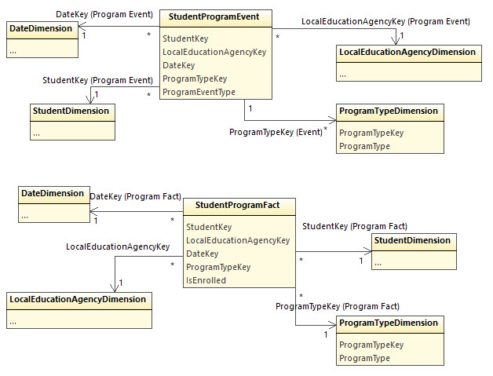

# Program Participation

These views are not part of the original [Early Warning
System](early-warning-system.md) use case. They could be useful for district
administrators who wish to study participation in programs such as Special
Education, Gifted and Talented, Title 1 Part A, and much more. Because the ODS
tracks program participation at the level of local education agency (district),
these views are keyed to the district instead of school.

No additional security views have been provided. Any use of these views needs to
carefully consider how to protect student data privacy. One could limit access
to these views to district  or even state administrators through the BI's data
model or through the sharing mechanism for a BI dashboard.

The file `samples/ProgramViews.sql` file has three sample views. These views
could be pulled into an analytics engine as is or could be used as inspiration
for building calculated columns / tables in the analytics tool's data model.

## StudentProgramParticipation

Returns the number of days a student is enrolled in a special program. Sample
records:

| StudentKey | LocalEducationAgencyName | ProgramType | Duration |
| ---------- | ------------------------ | ----------- | -------- |
| 100134477 | Glendale ISD | Special Education | 292 |
| 100133609 | Glendale ISD | Gifted and Talented | 36 |
| 100062665 | Glendale ISD | Section 504 Placement | 292 |

## DistrictProgramParticipation

Count and average duration of students in programs by district. Sample records:

| LocalEducationAgencyName | ProgramType | NumberOfStudents | AverageDuration |
| ------------------------ | ----------- | ---------------- | --------------- |
| Glendale ISD | Bilingual | 647 | 283 |
| Glendale ISD | Bilingual Summer | 130 | 292 |
| Glendale ISD | Career and Technical Education | 823 | 291 |

# StudentsAtRiskWhoAreNotInAnInterventionYet

Students at risk who are not already in an intervention-related program
('Counseling Services', 'Student Retention/Dropout Prevention', 'Early
Intervention Services Part C'). Sample records:

| StudentName |SchoolName | MathGrade | EnglishGrade |OverallGrade | AttendanceRate | GradeIndicator | AttendanceIndicator | BehaviorIndicator |
| ----------- | --------- | --------- | ------------ | ----------- | -------------- | -------------- | ------------------- | ----------------- |
| Kristine H Medeiros |Belmont High School| 0.000000 | NULL | 0.000000 |1.0000000000000000000 |At risk | On track | On track |
| Tyrone J Funes |Belmont High School| 86.000000 | 54.000000 |83.375000 |0.8742857142857142857 | At risk | Early warning | On track |
| Marquis U Gamble |Dorsey High School | 16.000000 | NULL |71.714285 |0.9106145251396648044 |At risk | On track | On track |
